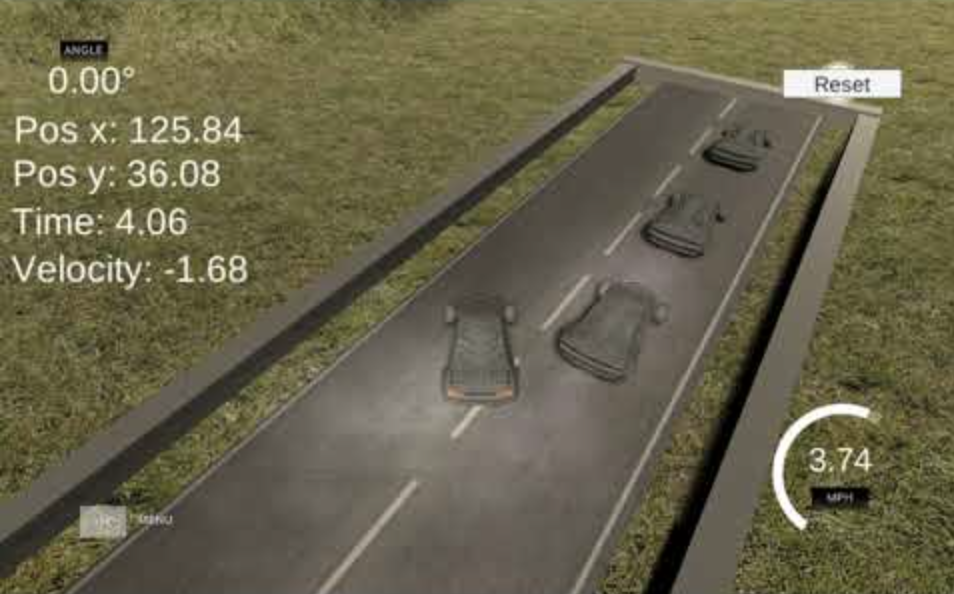
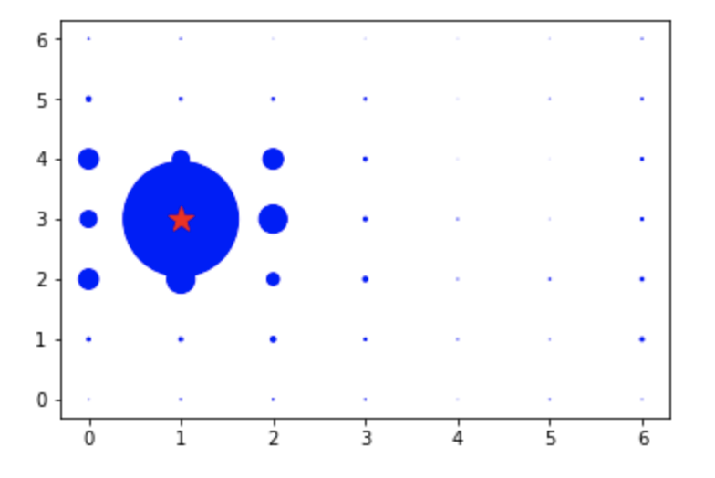
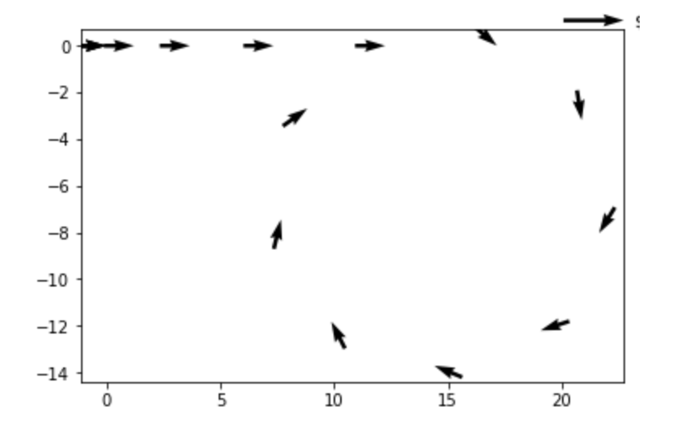
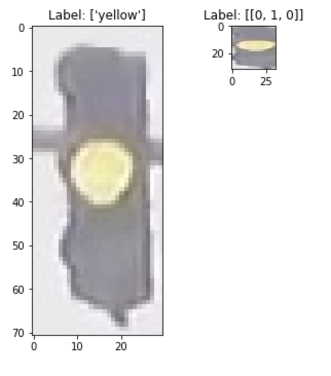

# Intro To Self Driving Cars Nanodegree

<h2>Introduction</h2>

I completed the **Intro To Self Driving Cars Nanodegree** by Udacity on May 16th, 2020. I had the opportunity to sharpen my python skills, apply C++, implement matrices and calculus in code, and touch on computer vision and machine learning all in the context of solving self-driving car problems.

**Certification:** https://graduation.udacity.com/nd113

<h2>Summary Of Projects</h2>

* The course began with a deep dive into **Bayesian Thinking**. Human drivers observe their environment when driving and make decisions based on the likelihood of events happening. Of course, a driver doesn't actually calculate the probability of a car passing behind another car, however we trust probabilities because it is the only way to take action in the midst of uncertainty. Autonomous systems such as self driving cars make similar decisions based on probabilities, however, instead of intuition and experience self driving cars calculate the probability of events using sensors and programming which reasons out what action to take. The two projects that I completed was the **Joy Ride** project where I had to program the simulation of a car in a drag race, going around a circular track and conducting parallel parking as well as the **Programming A Histogram Filter In Python** project where a Bayes filter that represents beliefs as a histogram was created in order to solve a localization problem.   
     
   

   

* Next, in **Working with Matrices** the focus was on two tools which are vital to self-driving car engineers: object oriented programming and linear algebra, understood through the completion of the **Implement A Matrix Class** and **Kalman Filter** projects. 

   

* The foundations of **C++** were also introduced in the course. This was a first step in a rewarding journey towards C++ expertise. The goal of the **Python to C++** project was translation: get a program written in Python, and translate it into C++. 

* After this, I focused on **Performance Programming in C++** where the course explored how to write good code that runs correctly and best, industry practices. Through the **Optimizing The Histogram Filter** project, I worked on making the python code I had translated into C++ run faster and more efficiently. 

* **Navigating and Data Structures** really tested and allowed me to work on algorithmic thinking by using data structures and algorithms. Through the **Implementing A Route Planner** project, I implemented an A-Star search algorithm to find the shortest path between a starting node and a destination node on a map.

* Next, the course took a look at **Vehicle Motion And Control**, where the use of calculus and trigonometry in self driving cars became apparent. Additionally, there was a lesson on how a self driving car uses various motion sensors to help it understand its own motion. At the end of this section in the **Reconstructing Trajectories Using Sensor Data** project, I used raw sensor data (which gave information about the distance driven, acceleration, and rotation rates of a car) in order to reconstruct a vehicle's trajectory through space.

* Finally, in the **Computer Vision And Machine Learning** section of the course, I learnt how a computer sees an image and how we can use machine learning to teach a computer to identify images programmatically. The final **Traffic Light Classifier** project tested my understanding and skill of these concepts by tasking me to programatically classify whether a traffic light is red, yellow or green with an incredibly high accuracy of 95-100% (as a driver's life is dependent on such a classification) using computer vision and machine learning.

   The code for the projects can be found in the appropriate subfolders above.  

